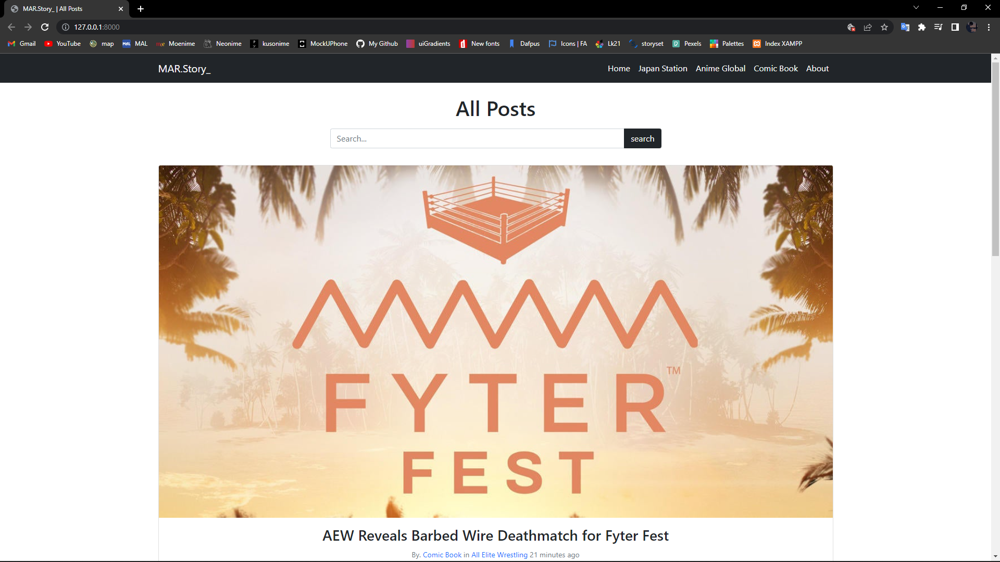
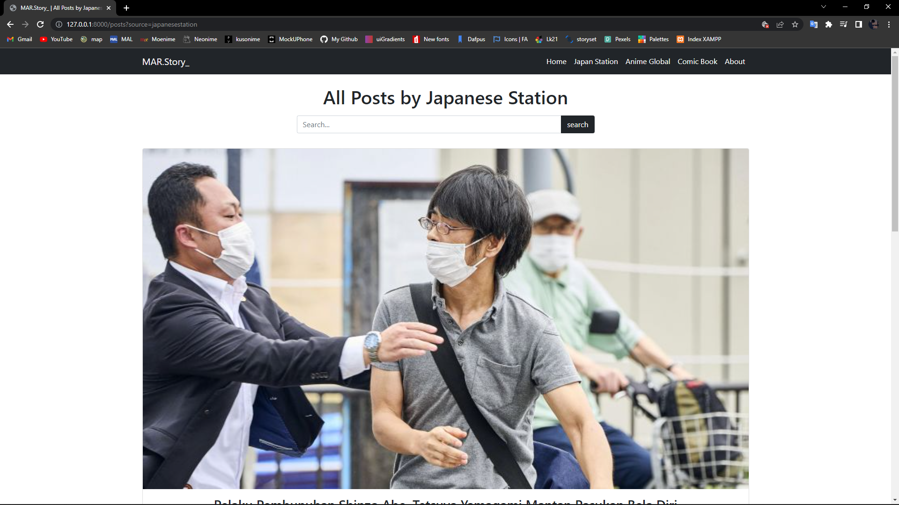
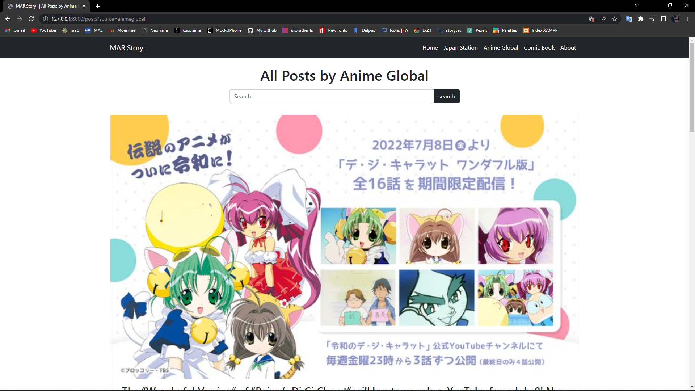
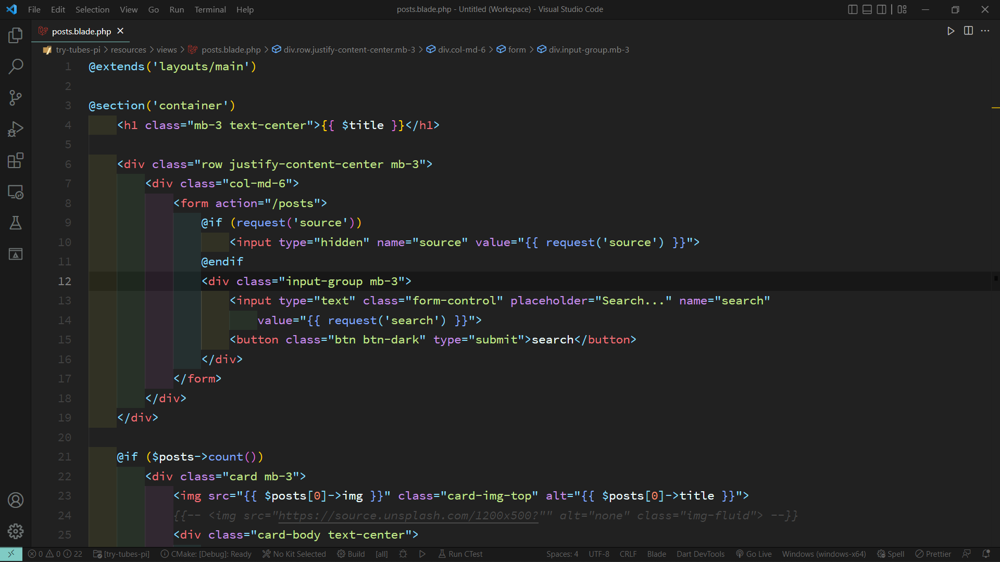
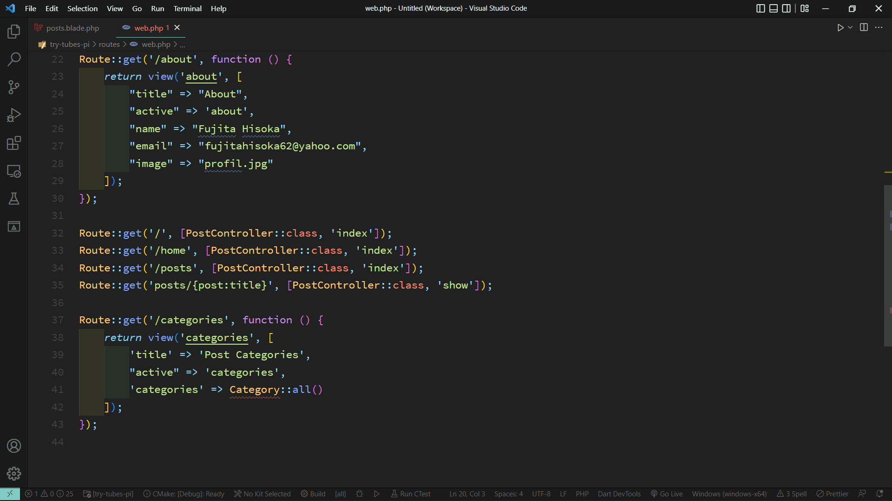
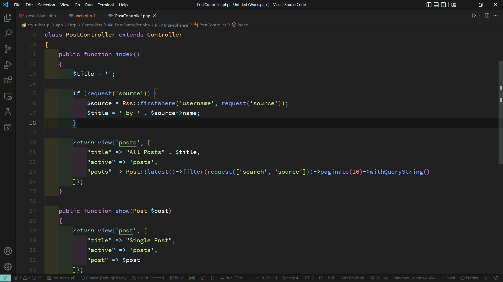

# Integratif---IT0202---1202190019

## Tahapan instalasi Laravel

- Pertama, pastikan pada perangkat anda telah terinstall php minimal versi 7.4. Cek versi php kalian pada terminal / cmd dengan mengetikkan `php -v`.

- Jika php yang terinstall sudah versi 7.4 / keatas, maka kita bisa lanjut dengan menginstall composer. Download composer disini [https://getcomposer.org/].

- Setelah kita menginstall composer, kita dapat membuka kembali terminal / cmd kemudian masuk ke dalam direktori folder tempat kita akan menyimpan project laravel tersebut. Misalnya pada kasus saya, `cd ~/Documents/Kuliah/Pemrograman_Integratif/Tugas_Akhir/Integratif---IT0202---1202190019 `.

- Setelah kita berada di direktori folder yang kita inginkan, ketikkan `composer create-project laravel/laravel project-akhir` untuk mulai menjalankan intallasi dari laravel tersebut.

- Setelah proses instalasi selesai dijalankan, kita dapat masuk ke dalam folder project laravel yang telah kita install dengan mengetikkan `cd project-akhir`.

- Kemudian untuk kita dapat mengakses project laravel kita, kita dapat mengetikkan `php artisan serve` pada terminal / cmd yang berada di dalam direktori folder project kita tadi. 

- Kemudian, akan muncul IP development server, copy dan pastekan ip tersebut di browser kesayangan anda untuk mengakses project yang akan kita bangun. 

## Struktur Database

Database yang digunakan pada project ini terdiri dari 3 tabel dinamis (kemungkinan berubah dalam masa development) yang itu **tabel posts** yang akan menangani isi dari berita yang akan di tampilkan, **tabel categories** yang akan menangani data berdasarkan kategori dari rss yang didapat, dan **tabel user** yang akan menangani data sumber dari rss yang digunakan dengan konfigurasi isi sebagai berikut:

**Tabel posts**

- id (Primary Key)
- category_id (Foreign Key)
- user_id (Foreign Key)
- img_url
- title
- slug
- excerpt
- body
- created_at
- update_at

**Tabel categories**

- id
- name
- slug
- created_at
- updated_at

**Tabel User**

- id
- name
- username
- created_at
- updated_at

Link **RSS** yang digunakan pada project ini adalah sebagai berikut

- https://japanesestation.com/feed
- https://animeanime.global/feed
- https://comicbook.com/feed/

**Halaman**

Tampilan All Post (Semua Post dari semua RSS akan tampil pada halaman ini)

Tampilan All Post pada RSS Japanese Station (tampilan akan di filter berdasarkan sumber dari RSS Japanese Station)

Tampilan All Post pada RSS Anime Global (tampilan akan di filter berdasarkan sumber dari RSS Anime Global)

Tampilan All Post pada RSS Comic Book (tampilan akan di filter berdasarkan sumber dari RSS Comic Book)

Tampilan about

**Cara Pembuatan**

- Buat file posts.blade.php untuk menampung desain web dan melakukan pemanggilan data ke database dengan variabel yang telah ditentukan

  

- Kemudian, lakukan routing atau penjaluran agar halaman website tampil sesuai dengan yang diinginkan

  

- kemudian untuk melakukan beberapa fitur seperti filter dan search dapat dilakukan pada controller

  